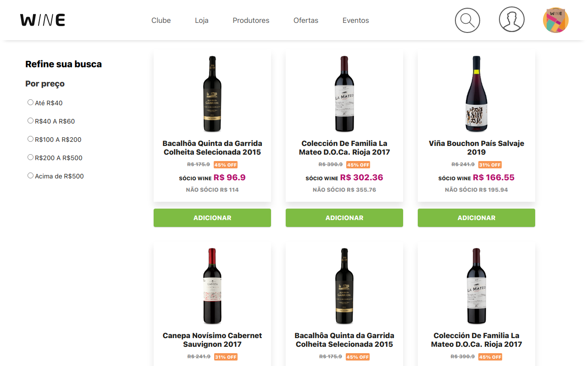

# Boas-vindas ao repositório do desafio técnico da Wine!

# Contexto :wine_glass:
O objetivo deste desafio foi construir uma aplicação Next.js capaz de consumir a API REST da Wine e reproduzir as seguintes funcionalidades: 

- Listar produtos;
- Filtrar produtos por preço;
- Pesquisar produtos;
- Adicionar produtos ao carrinho;
- Exibir uma página de detalhamento de um produto.

A estilização da interface foi feita com Styled Components, seguindo o protótipo disponibilizado pela Wine.

Você pode conferir o deploy da aplicação clicando <a href="https://desafio-tecnico-wine.vercel.app/">aqui!</a>



# Instalando o projeto

  1. Clone o repositório:
  ```
  git clone git@github.com:riquelmebandeira/desafio-tecnico-wine.git
  ```

  2. Entre na pasta do repositório clonado:
  ```
  cd desafio-tecnico-wine
  ```

  3. Instale as dependências com o comando:
  ```
  npm install
  ```
  
  4. Faça a build e rode a aplicação:
  ```
  npx next build && npm start
  ```

  Ao concluir, a interface ficará disponível em: http://localhost:3000
